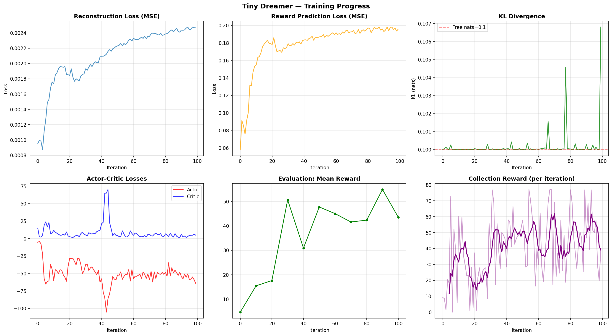
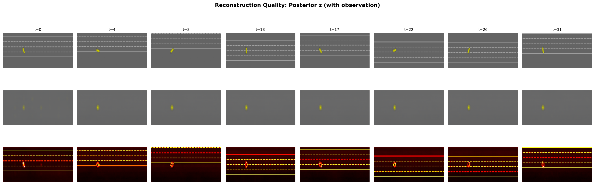
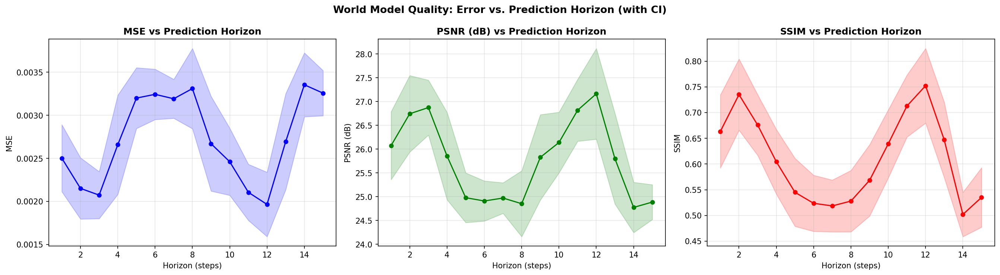

# TinyDreamer — A Dreamer V1-Style World Model for Highway Driving

A compact implementation of a **Dreamer V1**-style model-based reinforcement learning agent that learns a *world model* of the `highway-v0` driving environment and trains its policy entirely "in imagination" — inside the learned latent dynamics rather than the real environment.

This was the final project for CSC-580 (Artificial Intelligence 2).

## Overview

Model-based RL agents learn a predictive model of their environment and use it to plan or to generate synthetic experience. Following [Dreamer V1](https://arxiv.org/abs/1912.01603), this project builds a recurrent latent world model and an actor-critic that is optimized on rollouts *imagined* by that model, making learning far more sample-efficient than model-free approaches.

The agent is trained and evaluated on **`highway-v0`** from [Gymnasium Highway-Env](https://highway-env.farama.org/), using pixel observations and continuous actions.

## Architecture

The world model follows Dreamer V1 with some architectural improvements:

- **Encoder** — CNN → fully-connected embedding (512-dim bottleneck) that compresses pixel frames into a latent vector.
- **RSSM (Recurrent State-Space Model)** — a GRU-based recurrent core with deterministic hidden state `h=256` and stochastic latent `z=256`, modeling the environment's temporal dynamics.
- **Decoder** — FC → transposed-CNN that reconstructs frames from the latent state (used for representation learning).
- **Reward model** — an MLP predicting reward from the latent state `(h, z)`.
- **Actor-Critic** — policy (actor) and value (critic) networks trained on imagined trajectories rolled out inside the learned model.

Training uses an episode-based **replay buffer** with fixed-length sequence sampling for the recurrent model.

## Results

Selected outputs are in `results/`:

| Artifact | File |
|---|---|
| Agent driving (rollout) | `results/agent_driving.gif` |
| Real vs. imagined comparison | `results/comparison.gif` |
| Learning curves | `results/learning_curves.png` |
| Reconstruction quality | `results/reconstruction_quality.png` |
| N-step prediction (overlay / side-by-side) | `results/nstep_overlay.png`, `results/nstep_sidebyside.png` |
| Prediction error vs. horizon | `results/error_vs_horizon.png` |
| Imagination-horizon ablation | `results/ablation_horizon.png` |







> **Note:** Trained model checkpoints (`.pt`, ~44 MB each) are not included because they exceed GitHub's file-size limits. Re-run the notebook to regenerate them, or distribute them via [Git LFS](https://git-lfs.com/) or a GitHub Release.

## Repository structure

```
.
├── notebooks/
│   └── World_Model.ipynb        # Full implementation: world model, imagination training, evaluation
├── results/                     # Plots and GIFs from training/evaluation
├── reports/
│   ├── Final_Report.pdf
│   ├── DefaultProject.docx
│   ├── Option1_project_prompt.pdf
│   └── Option2_project_prompt.pdf
├── requirements.txt
└── README.md
```

## Getting started

1. Clone the repository:

   ```bash
   git clone https://github.com/<your-username>/TinyDreamer-World-Model.git
   cd TinyDreamer-World-Model
   ```

2. (Recommended) Create and activate a virtual environment:

   ```bash
   python3 -m venv .venv
   source .venv/bin/activate      # On Windows: .venv\Scripts\activate
   ```

3. Install dependencies:

   ```bash
   pip install -r requirements.txt
   ```

4. Open the notebook. A GPU is strongly recommended for training (Google Colab with a GPU runtime works well):

   ```bash
   jupyter notebook notebooks/World_Model.ipynb
   ```

## Requirements

- Python 3.10+
- PyTorch
- Gymnasium and `highway-env`
- NumPy, matplotlib, imageio, OpenCV (`opencv-python`), scikit-image, Pillow, tqdm
- A GPU is strongly recommended for training the world model.

## References

- Hafner et al., *Dream to Control: Learning Behaviors by Latent Imagination* (Dreamer V1), 2020. https://arxiv.org/abs/1912.01603
- Gymnasium Highway-Env: https://highway-env.farama.org/

## Author

Krishnarjun Lakshminarayanan — CSC-580 Artificial Intelligence 2, final project.
